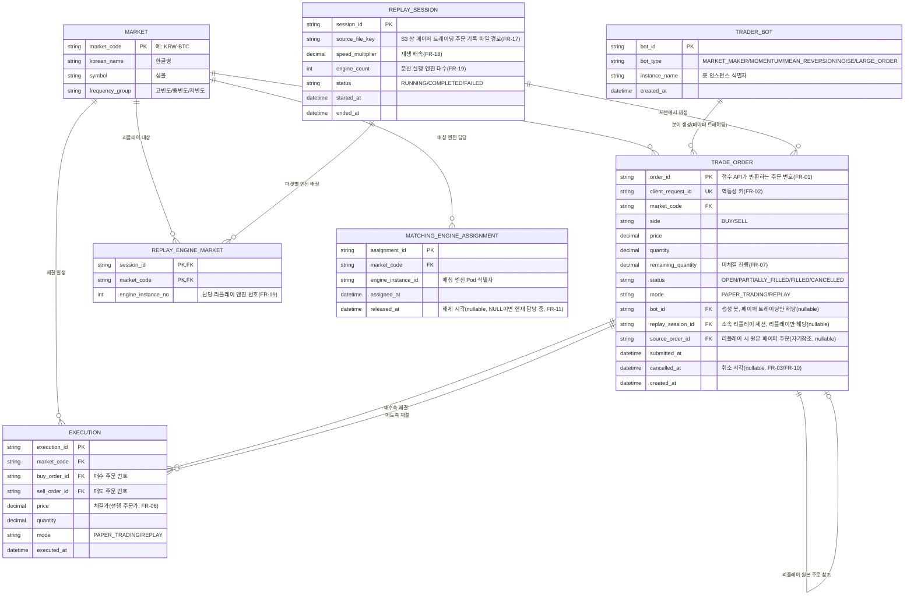

# ERD (Entity Relationship Diagram)

## 변경 이력
| 날짜 | 변경 내용 |
|---|---|
| 2026-07-31 | requirements.md(1장·2장) 기준으로 ERD 최초 작성 |

## 1. 설계 범위

이 ERD는 [requirements.md](requirements.md) 1.2.1 데이터 흐름에서 **DB(RDS/PostgreSQL)** 저장 대상으로 명시된 데이터만을 다룬다.

> "기록기가 체결 결과를 DB(RDS/PostgreSQL)에 저장한다. 저장 대상은 페이퍼 트레이딩 이력, 리플레이 이력, 리플레이시 발생하는 체결 결과로 구분해 관리한다" (1.2.1)

### 범위 제외 (다른 저장소로 관리)
| 데이터 | 저장소 | 제외 사유 |
|---|---|---|
| 호가창(미체결 주문) 현재 상태 | Redis(ElastiCache) | 인메모리로만 유지, 디스크 미기록(1.2.2, NFR-03) |
| 리플레이시 발생하는 주문 결과(실시간 조회용) | Redis(ElastiCache) | 조회 API·트레이더·리플레이 엔진이 즉시 읽는 캐시 용도(1.2.1-5) |
| 업비트 시세 원본(초/분/일/주/월/년 OHLCV, 개별 체결) | S3 | 시계열 원본 데이터, 관계형 모델 대상 아님(1.2.1, FR-14) |
| 페이퍼 트레이딩 주문 기록 파일 | S3 | 리플레이 입력 파일(FR-17), 파일 형태로 저장 |
| TPS·컨슈머 랙·응답시간 등 운영 지표, 로그 | 모니터링 스택(Prometheus 등) | 시계열 지표, RDS 대상 아님(FR-21, NFR-16) |

이 ERD가 다루는 것은 **주문·체결·봇·리플레이 실행·엔진 배정**이며, 근거 요구사항은 FR-01\~04(주문), FR-05\~11(매칭·재분배), FR-13(거래 내역 조회), FR-16(트레이더 봇), FR-17\~19(주문 기록·리플레이·분산 실행)이다.

## 2. ER 다이어그램

## 3. 엔티티 설명

### MARKET
업비트 원화 마켓 20개 종목의 마스터 데이터(1.1.4). 신규 상장·상장폐지가 없는 고정 목록이므로 값이 자주 바뀌지 않는다.

### TRADER_BOT
FR-16의 5종 봇(마켓메이커/모멘텀추종/평균회귀/노이즈/대량 주문자) 인스턴스. 모니터링 화면의 "봇별 주문 현황"(FR-25) 집계 기준이 된다.

### TRADE_ORDER
접수 API가 처리하는 모든 주문. `mode`로 페이퍼 트레이딩/리플레이를 구분하고(FR-09), 리플레이 주문은 `source_order_id`로 원본 페이퍼 트레이딩 주문을 참조해 "동일 파일 재생 시 총 주문 수·마켓별 비율 동일"(FR-18 검증)을 추적할 수 있게 한다. `client_request_id`는 중복 주문 방지(FR-02) 판별 키다.

### EXECUTION
매칭 엔진이 체결한 결과(FR-06, FR-09). 매수·매도 주문 번호를 각각 참조해 "체결 결과의 매수·매도 주문 번호가 실제 체결 주문과 일치"(FR-09 검증)를 보장한다. 거래 내역 조회(FR-13)는 이 테이블을 최신순으로 조회한다.

### REPLAY_SESSION
리플레이 1회 실행 단위(FR-18). 입력 파일, 배속, 분산 실행 시 사용한 엔진 대수를 기록해 재현 가능성을 확보한다.

### REPLAY_ENGINE_MARKET
리플레이 분산 실행 시(FR-19) 세션 내에서 마켓을 어떤 리플레이 엔진 인스턴스가 담당했는지 기록한다.

### MATCHING_ENGINE_ASSIGNMENT
매칭 엔진 수 증감에 따른 마켓 재분배 이력(FR-11). "한 마켓은 항상 정확히 한 엔진만 담당"(1.2.2) 원칙을 `released_at IS NULL` 조건으로 검증할 수 있다.

## 4. 설계 근거 메모

- **order/execution 분리**: 부분 체결(FR-07)이 존재하므로 주문 1건에 체결이 여러 건 붙을 수 있어 1:N으로 분리했다.
- **mode 컬럼(테이블 분리 대신)**: 페이퍼 트레이딩/리플레이 이력을 별도 테이블로 나누는 대신 `mode` 컬럼으로 구분했다. 두 모드 모두 동일한 컬럼 구조(마켓·가격·수량·상태)를 쓰고, FR-18 검증("동일 파일 재생 시 총 주문 수·마켓별 비율 동일")처럼 두 모드를 서로 비교하는 조회가 잦기 때문에 테이블을 나누면 비교 쿼리마다 UNION이 필요해진다.
- **자기참조 source_order_id**: 리플레이는 "판단 로직 재실행 없이 그대로 재생"(1.1.2 용어 정의)하므로 리플레이 주문은 항상 페이퍼 트레이딩 원본 주문 하나에 대응한다. 이 관계를 표현하기 위해 TRADE_ORDER가 자기 자신을 참조한다.
- **가격/수량 정밀도**: `price`, `quantity`는 암호화폐 특성상 소수점 자리수가 커 부동소수점 오차가 정합성 요구사항(NFR-07\~10)에 영향을 줄 수 있으므로 DECIMAL(NUMERIC) 타입을 전제로 했다.
